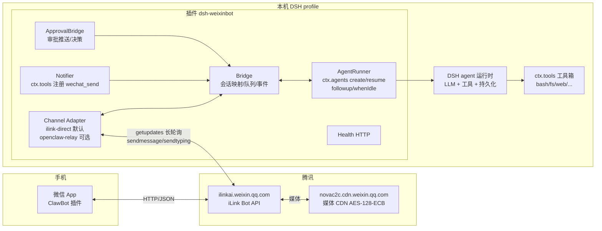
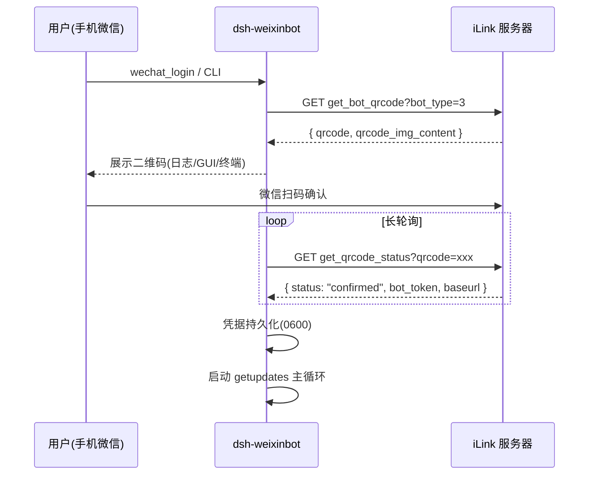
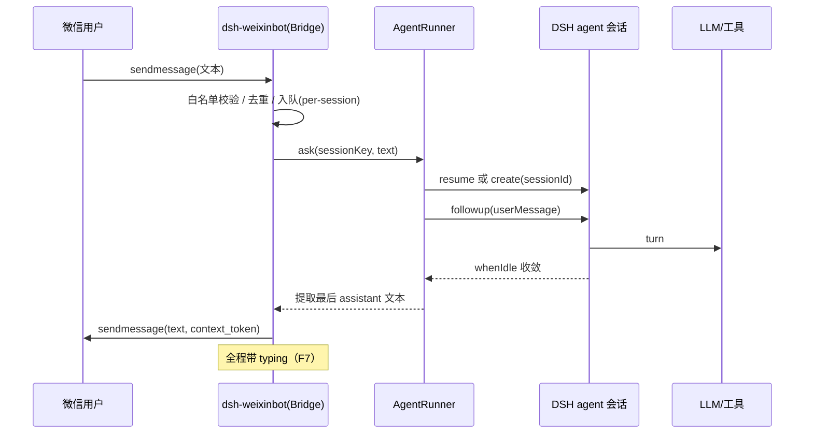
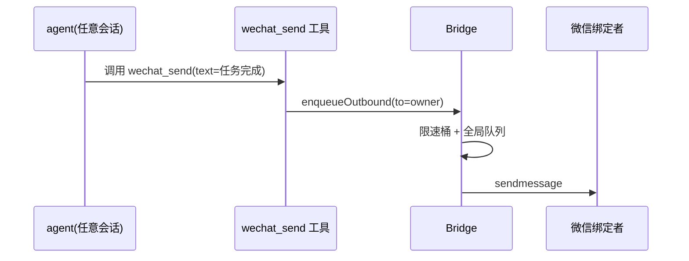
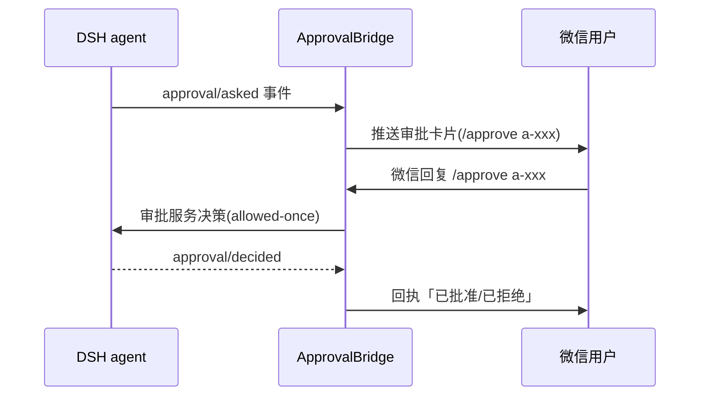

# dsh-weixinbot 功能设计

> 一个对接 DeepSeek Harness（DSH）的微信插件：把微信变成 DSH 的随身遥控器与消息通道。
> 复用两条官方能力链：**微信 ClawBot（腾讯 iLink Bot API，通过 OpenClaw 生态开放）** + **DSH 的 Cordis 插件体系**。
>
> - 状态：设计稿 v0.2（已按评审决策更新）
> - 日期：2026-08-14
> - 配套资料：见文末「参考资料」

---

## 1. 背景与目标

### 1.1 背景

- **DSH（DeepSeek Harness）** 是一个基于 Cordis 的 agent 框架，以 profile（多插件 bundle + patch 层叠加）方式组织插件。用户平时通过 Web GUI 与 agent 会话交互。
- **微信 ClawBot** 是腾讯官方开放的个人微信 Bot 能力：用户在微信内启用 ClawBot 插件，即可把微信消息转发给第三方 AI 服务（底层协议为 **iLink**，接入域名 `ilinkai.weixin.qq.com`，HTTP/JSON，无需 SDK）。腾讯官方为此发布了《微信 ClawBot 功能使用条款》，官方 npm 包为 `@tencent-weixin/openclaw-weixin`（OpenClaw 通道插件）与 `@tencent-weixin/openclaw-weixin-cli`。
- 现状痛点：DSH 的能力被锁在浏览器 GUI 里——出门在外、手机场景下无法随时「派活、查进度、批决策、收通知」。

### 1.2 目标

做一个 DSH 插件 `dsh-weixinbot`，实现：

| # | 目标 | 说明 |
|---|---|---|
| G1 | **双向消息桥** | 微信发消息 → DSH 专属持久 agent 会话回答 → 回发到微信；上下文跨消息、跨重启连续 |
| G2 | **主动推送** | DSH/agent 可主动把通知推送到微信（任务完成、需要决策、错误告警） |
| G3 | **随身影音** | 支持图片 / 语音 / 文件 / 视频收发（走官方 iLink CDN + AES-128-ECB） |
| G4 | **群聊可用** | 群内 @bot 触发，回复回群；群/人双层白名单（P2，已确认降级） |
| G5 | **审批联动** | DSH 的审批请求推到微信，用户在微信里批准/拒绝（P1，已确认纳入首版） |
| G6 | **运维自持** | 扫码登录、掉线自愈、限速退避、健康检查、日志，全部内建 |
| G7 | **GUI 目录收纳** | 所有微信会话在 Web GUI 中归入一个独立的「微信」目录，与普通会话分开显示（已确认） |

### 1.3 非目标（v1 明确不做）

- 不替代 Web GUI（微信是**补充通道**，GUI 始终可用，天然降级方案）。
- 不做企业微信 / 公众号 / 小程序（只做个人微信 ClawBot）。
- 不做多账号 Bot 矩阵（v2 预留适配器扩展）。
- 不依赖任何灰色协议（iText / PC Hook / 模拟 iPad），只走官方 iLink。

---

## 2. 术语表

| 术语 | 含义 |
|---|---|
| DSH profile | DSH 的配置组合单元：`package.json` + `dsh.profile.bundles` + `cordis.patch.yml` 用户补丁层 |
| bundle / patch 层 | DSH 插件组合包；每个插件通过 `cordis.patch.yml` 把自己的服务插入配置树 |
| ClawBot | 微信官方「小龙虾」插件，把微信个人账号桥接到第三方 AI |
| iLink | ClawBot 底层协议，官方服务器 `ilinkai.weixin.qq.com`，HTTP/JSON |
| bot_token | 扫码登录后获得的 Bearer 凭据（`baseurl` + token） |
| get_updates_buf | 长轮询游标，类似 Telegram `offset`，必须逐次回传，否则重复收消息 |
| context_token | 消息上下文令牌；**回复时必须原样带回**，否则消息进不了对应会话窗口 |
| agent 会话 | DSH 的持久化对话（`ctx.agents.create/resume`）；本插件的微信会话为 `im-wechat-*` |

---

## 3. 总体架构

### 3.1 架构图



### 3.2 关键架构决策

| 决策 | 选择 | 理由 |
|---|---|---|
| D1 接入方式 | **默认 `ilink-direct`**（✅ 已确认）：插件内置 iLink 协议实现（扫码登录 + 长轮询 + 发送 + CDN），不依赖 OpenClaw 进程 | 自包含、零外部服务依赖、与 DSH 同进程共生命周期；`dsh2wechat` 已验证该路可行 |
| D2 可选接入 | **`openclaw-relay` 适配器**：若本机已跑官方 OpenClaw + `@tencent-weixin/openclaw-weixin`，则经其通道中转发收 | 字面复用「官方给 openclaw 的 bot 能力」；为 D1 之外的部署形态留口子 |
| D3 消息注入 | 用 `ctx.agents.create/resume` + `agent.followup()` + `agent.whenIdle()` 驱动**每会话独立持久 agent** | DSH 官方 agent 运行时，上下文持久、跨重启恢复，与 GUI 会话隔离 |
| D4 通道抽象 | 定义 `ChannelAdapter` 接口（login / poll / send / sendTyping / upload），`ilink-direct` 与 `openclaw-relay` 双实现 | 未来可平移到企业微信/其他 IM |
| D5 配置注入 | schemastery schema + `cordis.patch.yml` 用户补丁层 | 符合 DSH 插件约定，`dsh plugin --profile web add` 即装 |
| D6 审批范围 | 审批桥 **纳入首版**（P1，✅ 已确认），`approval.enabled` 默认开启、可关 | API 变动风险用版本锁定 + flag 兜底（R4） |
| D7 群聊范围 | 群聊 **降级为 P2**（✅ 已确认），先不做 | 协议层保留 `group_id` 识别能力，配置留占位，后续按 P2 开启 |
| D8 GUI 呈现 | 微信会话在 GUI 侧边栏以**独立「微信」目录**（可折叠分组）展示，所有 `im-wechat-*` 会话收纳其中（✅ 已确认） | 优先复用原生会话列表插槽，否则由随附客户端插件（browser bundle）自绘目录，见 F15 |

### 3.3 插件形态

- npm 包 `dsh-weixinbot`（TypeScript + ESM，Node ≥ 22）。
- 包内 `cordis.patch.yml`（即 `dsh.bundle.patch`）声明插入：

```yaml
# cordis.patch.yml
- insert:
    - id: weixinbot
      name: 'dsh-weixinbot'
```

- 安装：`dsh plugin --profile web add dsh-weixinbot`，并把 `dsh-weixinbot` 加入 profile 的 `dsh.profile.bundles`。
- 用户配置写在 `$DSH_HOME/profiles/web/cordis.patch.yml`（覆盖层），见 §7。

---

## 4. 功能设计

功能按优先级分三档：**P0 MVP（可用的最小闭环）→ P1 增强（体验完整）→ P2 进阶（锦上添花）**。
功能编号在文档中稳定不变；优先级以所在分档为准（标注了「升降级」的条目为评审决策结果）。

### 4.1 P0 · MVP

#### F1 扫码登录绑定

- 复用 iLink 官方登录流：
  1. `GET /ilink/bot/get_bot_qrcode?bot_type=3` → 返回 `qrcode` 与二维码图片内容；
  2. 二维码渲染到 DSH 日志 / Web GUI（可选输出图片），用户手机微信「扫一扫」；
  3. `GET /ilink/bot/get_qrcode_status?qrcode=<qrcode>` 长轮询 → `status: confirmed` 后拿到 `bot_token` 与 `baseurl`；
  4. 凭据持久化到 `$DSH_HOME/weixinbot/credentials.json`（**权限 0600**，token 绝不写日志）。
- 入口：插件提供 `wechat_login` 工具（agent 可代跑）+ 独立 CLI `node tools/wechat-login.mjs --write`（免启动 profile 也可先绑定）。
- 过期处理：轮询/发送遇鉴权失败（如 `prepare failed`）→ 标记 `logged_out`，日志与微信端提示「请重新扫码」。

#### F2 消息接收（getupdates 长轮询）

- 主循环：`POST /ilink/bot/getupdates`，body `{ get_updates_buf, base_info: { channel_version: "1.0.2" } }`；服务端 hold 最长 35s。
- 响应 `{ ret, msgs, get_updates_buf, longpolling_timeout_ms }`；**游标必须逐次更新**，失败不推进游标（防丢消息），重复消息按 `msg_id` 去重。
- 请求头固定套路：

```http
Content-Type: application/json
AuthorizationType: ilink_bot_token
X-WECHAT-UIN: <base64(random uint32)>   # 每次随机，防重放
Authorization: Bearer <bot_token>
```

- 消息规范化（见 §6.1 `InboundMessage`）：用户 ID `xxx@im.wechat`、Bot ID `xxx@im.bot`、`message_type: 1`（用户）、`context_token`、`item_list[]`。

#### F3 会话映射

- 每个微信会话（单聊按 `from_user_id`，群聊按 `group_id`，v1 仅单聊）映射一个 DSH 持久 agent 会话。
- `sessionId = im-wechat-<sha256(channelKey).slice(0,16)>`，保证稳定且不与 GUI 会话冲突。
- 每个会话一个**串行队列**：同一会话同时只跑一个 turn（后续消息排队），不同会话可并行。
- 跨插件热重载复用：进程级 live-agent 表（`Map<sessionKey, AgentHandle>`），重复 `apply` 不重建会话。

#### F4 消息注入与回复

- 注入：`createUserMessage({ content:[{type:'text',text}], source:{kind:'user'} })` → `agent.followup(msg)`。
- 等待：`agent.whenIdle()` 与 `timeoutMs`（默认 120s）竞速，超时 `agent.cancel({kind:'hook', reason:'weixinbot timeout'})`。
- 提取回复：从 turn 起点后新增的 `session/event` 中取最后一条 `assistant/message` 文本。
- 回发：`POST /ilink/bot/sendmessage`，**必须携带原 `context_token`**：

```json
{
  "msg": {
    "to_user_id": "<from_user_id>",
    "message_type": 2,
    "message_state": 2,
    "context_token": "<原样带回>",
    "item_list": [{ "type": 1, "text_item": { "text": "..." } }]
  }
}
```

- 失败兜底：turn 异常/超时 → 回发「❌ 处理失败：<可读原因>」；插件自身崩溃由进程级 error 钩子记录，不让 DSH 进程退出。

#### F5 白名单与权限（fail-closed）

- `allowUsers`（单聊白名单，默认**空 = 全部拒绝**）、`allowGroups`（群白名单，默认空 = 拒绝所有群，P2 生效）。
- 命中规则：单聊看 `from_user_id`；群聊看 `group_id` 且在群白名单内；两者都不匹配则丢弃并计日志。
- 可选 `adminUsers`：管理命令（/new、/status）仅管理员可执行。

#### F6 健康检查与日志

- 插件内起 `http://127.0.0.1:<port>/health`（默认 3901），返回 `{ ok, loggedIn, pollAlive, lastPollAt, queueDepth, sessions }`，供本地监控/看门狗。
- 日志双写：`ctx.logger`（DSH 日志体系）+ 独立文件 `$DSH_HOME/weixinbot/weixinbot.log`（进程级错误钩子写入，便于排查）。

### 4.2 P1 · 增强

#### F7 typing「正在输入」

- turn 开始时：`POST /ilink/bot/getconfig` 取 `typing_ticket` → `POST /ilink/bot/sendtyping`（对 `to_user_id`）；
- 长 turn 按节拍刷新；turn 结束发送停止。
- 失败静默降级（typing 只是体验项，不阻塞主流程）。

#### F8 多模态接收

| item type | 含义 | 处理 |
|---|---|---|
| 1 | 文本 | 直接注入 |
| 2 | 图片 | CDN 下载 + AES-128-ECB 解密 → 存 `$DSH_HOME/weixinbot/media/` → 注入 agent（文件路径；若配置了视觉模型则附图片 block） |
| 3 | 语音 | silk 解码 + 官方附带转文字优先；无转写则存文件并提示 |
| 4 | 文件 | 存盘注入路径，回复中回显文件名/大小 |
| 5 | 视频 | 存盘注入路径（大文件限长，默认 25MB） |

- CDN 细节：上传前用随机 AES-128 key 加密，`getuploadurl` 取预签名 URL，PUT 到 CDN，`sendmessage` 携带 `aes_key`(base64) 与 CDN 引用。
- 注入形态待定项：DSH `createUserMessage` 的 content block 是否支持附件路径/图片，需在实现期确认（见 §11 风险 R5）。

#### F9 多模态发送（agent 工具）

- 注册 `wechat_send` 工具（`ctx.tools.register(defineTool(...))`）：
  - 参数：`text?`、`filePath?`、`to?`（默认 = 绑定者本人；`to: "group:<groupId>"` 发群，P2 生效）。
  - 文本直发；文件走加密上传流程；返回「已发送」或可读失败原因。
- 与 `wechat_notify` 的关系：`wechat_notify` 是纯通知语义（无文件），`wechat_send` 是通用发送（含文件），实现共用一个发送内核。

#### F10 管理命令

- 前缀 `commandPrefix`（默认 `/`），支持：`/help`、`/new`（开新会话，丢弃旧上下文）、`/status`（登录态/队列/模型）、`/whoami`、`/cancel`（取消当前 turn）。
- 仅 `adminUsers` 可执行 `/new`、`/cancel`。

#### F11 限速与退避

- 官方实测约 **7 条 / 5 分钟**（未公开，需实测校准，配置项 `rateLimit`）。
- 实现：per-session token bucket（默认 `7/300s`）+ 全局发送队列；`429` 指数退避（1s → 2s → 4s … 上限 60s）。
- 超限消息不丢弃：排队，回复里提示「消息已排队」。

#### F12 审批流桥接（✅ 已确认纳入首版，`approval.enabled` 默认开启）

- 监听 DSH 审批事件（`approval/asked` / `approval/decided`，`dsh-user-approval` 服务）。
- `approval/asked` → 向绑定者推送微信卡片式文本：

```
🔐 需要你的批准（ID: a-xxxx）
操作：bash 执行命令 rm -rf ...
会话：im-wechat-xxx
回复「/approve a-xxxx」或「/reject a-xxxx」
```

- 微信侧解析 `/approve|/reject <id>` → 调用审批服务决策（`ApprovalOutcome: allowed-once / rejected`）。
- 失败语义：审批「不可达」时 fail-closed（维持 DSH 默认拒绝行为）。
- 风险：审批服务 API 随 DSH 版本演进（见 §11 R4）。

### 4.3 P2 · 进阶

#### F13 群聊（由 P1 降级，✅ 已确认）

- 识别：inbound 消息带 `group_id` 即群消息；触发方式：群里 @bot（`@<bot名>` 前缀）或配置 `groupTrigger: "mention" | "any"`（any 有刷屏风险，默认 mention）。
- 会话映射：按 `group_id` 建群会话；回复目标 = 群；`context_token` 同样原样带回。
- 回复头可配置加 `@<发言人>` 便于区分（默认关）。
- 协议层在 v1 即保留 `group_id` 识别与群白名单字段（配置占位），P2 只差开关与界面。

#### F14 会话管理增强

- `/context`：让 agent 输出当前会话摘要；`sessionTtlDays`：超时未活跃的 `im-wechat-*` 会话自动清理（防止 `$DSH_HOME` 膨胀）。
- 会话列表信息并入 `/health`。

#### F15 GUI 微信目录（✅ 已确认）

- 目标：Web GUI 会话区出现一个**独立的「微信」目录**，所有 `im-wechat-*` 会话统一收纳其中，与普通 GUI 会话分开显示；目录可折叠，条目标题形如 `微信 · <昵称>`。
- 实现路径（按优先级）：
  1. 优先探明 DSH 侧边栏/会话列表是否提供原生「分组/目录」插槽（客户端 slots），有则注册分组并绑定 `im-wechat-*` 前缀；
  2. 否则随附一个 **browser-only 客户端插件**（仿 `dsh-better-sidebar` 模式），在侧边栏注入可折叠「微信」目录，列出 `im-wechat-*` 会话并支持点击进入会话视图。
- 依赖：主插件（host 侧）为会话提供分组元数据；实现期需验证客户端插槽 API（见 §11 R8）。

#### F16 统计与多账号（v2 预留）

- 消息数/工具调用/token 消耗的轻量计数，`/status` 展示；多账号 = ChannelAdapter 多实例化。

---

## 5. 关键流程

### 5.1 登录流程



### 5.2 消息处理流程（单聊）



### 5.3 主动通知流程



### 5.4 审批流程（F12）



---

## 6. 数据结构与持久化

### 6.1 消息模型

```ts
// 规范化入站消息
interface InboundMessage {
  kind: 'direct' | 'group'          // v1 只处理 direct
  channelKey: string                // from_user_id 或 group_id
  senderId: string                  // 发言者（群聊）
  fromUserId: string                // 原样透传，回发目标
  contextToken: string              // 回发必须携带
  msgId: string                     // 去重
  items: MediaItem[]                // item_list 规范化
  receivedAt: number
}

interface OutboundMessage {
  to: string                        // to_user_id 或群
  contextToken?: string
  text?: string
  file?: { path: string; kind: 'image'|'file'|'voice'|'video' }
}
```

### 6.2 持久化清单

| 数据 | 位置 | 说明 |
|---|---|---|
| 凭据 | `$DSH_HOME/weixinbot/credentials.json` | `{ botToken, baseUrl, botId }`，0600 |
| 游标 | `$DSH_HOME/weixinbot/cursor.json` | `get_updates_buf`，崩溃后不重收 |
| 媒体 | `$DSH_HOME/weixinbot/media/` | 解密后文件，按 TTL 清理 |
| 会话映射 | 无需落盘 | `sessionId` 由 `channelKey` 哈希派生，天然稳定 |
| 运行日志 | `$DSH_HOME/weixinbot/weixinbot.log` | 进程级错误 + 关键事件 |

---

## 7. 配置设计（cordis.patch.yml 覆盖层示例）

```yaml
- insert:
    - id: weixinbot
      name: 'dsh-weixinbot'
      config:
        enabled: true
        adapter: ilink-direct          # ilink-direct | openclaw-relay（D1 默认 ilink-direct）
        # ilink-direct 凭据（也可用 wechat_login 扫码，二选一）
        credentials: null              # { botToken, baseUrl } 优先于扫码
        poll:
          timeoutMs: 35000
          retryDelayMs: 2000
        queue:
          turnTimeoutMs: 120000        # 单轮 agent 超时
          rateLimitPer5min: 7          # 官方实测约 7 条/5min
        media:
          dir: null                    # 默认 $DSH_HOME/weixinbot/media
          maxFileBytes: 26214400       # 25MB
        typing: true
        allowUsers: []                 # 空 = 全部拒绝（fail-closed）
        allowGroups: []                # 空 = 拒绝所有群（F13 P2 生效）
        adminUsers: []
        groupTrigger: mention          # mention | any（F13 P2 生效）
        commandPrefix: /
        notifier:
          enabled: true                # 注册 wechat_send / wechat_notify
          defaultTarget: owner         # owner | first-allowed-user
        approval:
          enabled: true                # F12 已确认纳入首版，默认开启；API 变动可关
        gui:
          directory: 微信               # F15：GUI 侧边栏「微信」目录名
          showInSidebar: true
        server:
          port: 3901
        logFile: true
```

---

## 8. 安全与合规

### 8.1 安全

- 凭据文件 0600；token 不出现在日志/回复/health 输出。
- 白名单 fail-closed；管理命令限 `adminUsers`。
- 群聊默认 mention 触发，防刷屏；大文件限长。
- 媒体文件为私有内容：解密后存本地，仅注入 agent，不做外部回传；提供一键清理。

### 8.2 合规（腾讯官方条款要点）

- 腾讯定位是「管道」：不存储输入/输出内容，但**收集 IP/操作/设备日志**（条款 5.3）。
- 腾讯保留**限流、拦截、终止服务**的权利（条款 4.7 / 7.2）——因此：
  - README 明示免责声明与使用边界；
  - 插件设计上**GUI 始终可用**，微信通道中断不影响 DSH 主体；
  - 不绕过微信技术保护措施，不用于违法违规用途。

---

## 9. 与现有插件对比与定位

| 能力 | dsh-wechat-notify | dsh2wechat | dsh-im-bridge(WIP) | **dsh-weixinbot（本设计）** |
|---|---|---|---|---|
| 双向消息桥 | ❌ 仅外发通知 | ✅ | ✅ 预留 | ✅ |
| 接入方式 | 调外部 clawbot CLI | 内置 iLink | 未定 | **内置 iLink（默认）+ openclaw-relay 可选** |
| 扫码登录 | ✅（工具） | ✅（CLI） | - | ✅ 工具 + CLI 双入口 |
| typing | ❌ | ❌ | - | ✅ |
| 多模态收发 | ❌ | 未明确 | - | ✅ 图片/语音/文件/视频 |
| 群聊 | ❌ | 未明确 | - | ✅（P2，已确认降级） |
| 审批推送/决策 | ❌ | ❌ | ✅ 目标 | ✅（首版，已确认） |
| 会话持久 agent | ❌ | ✅ | - | ✅（同 dsh2wechat 模式） |
| 健康检查 | ❌ | ✅ | - | ✅ 增强版 |
| 限速退避 | ❌ | ✅ | - | ✅ token bucket + 指数退避 |
| 管理命令 | ❌ | ❌ | - | ✅ /new /status /cancel |
| GUI 微信目录 | ❌ | ❌ | - | ✅（P2，客户端目录） |

**差异化定位**：一体化（登录/收发/typing/多模态/通知/审批/运维全内置）、双适配器架构、模块化可测试、中文文档完善。dsh2wechat 是很好的参照实现，本项目在它之上补齐 typing、多模态、审批、GUI 目录与统一运维面。

---

## 10. 技术选型与工程结构

### 10.1 技术栈

- TypeScript + ESM，Node ≥ 22；构建 `tsc`；测试 `vitest`（协议层用 mock server 单测）。
- 依赖（peer）：`@deepseek-ai/cordis`、`@deepseek-ai/dsh-tools`、`@deepseek-ai/dsh-agent`、`@deepseek-ai/dsh-session`、`@deepseek-ai/dsh-llm`、`@deepseek-ai/dsh-user-approval`（F12）、`schemastery`。
- 协议层零依赖：`fetch` 直连 iLink；AES-128-ECB 用 `node:crypto`。

### 10.2 源码结构（草案）

```text
dsh-weixinbot/
├── package.json               # dsh.bundle.patch → cordis.patch.yml
├── cordis.patch.yml           # 插件插入声明
├── src/
│   ├── index.ts               # cordis 插件入口 apply(ctx, config)
│   ├── config.ts              # schemastery schema
│   ├── adapter/
│   │   ├── channel.ts         # ChannelAdapter 接口
│   │   ├── ilink-direct.ts    # iLink 直连实现（auth/poll/send/typing/cdn）
│   │   └── openclaw-relay.ts  # 经官方 openclaw 通道中转（可选）
│   ├── bridge/
│   │   ├── bridge.ts          # 会话映射、队列、事件路由
│   │   └── session-map.ts
│   ├── runner/
│   │   └── agent-runner.ts    # ctx.agents create/resume/followup/whenIdle
│   ├── notifier/
│   │   └── tools.ts           # wechat_send / wechat_notify / wechat_login
│   ├── approval/
│   │   └── bridge.ts          # F12 审批桥
│   ├── server/
│   │   └── health.ts
│   ├── client/                # F15 browser-only 客户端插件（微信目录）
│   │   └── sidebar-wechat-dir.tsx
│   └── util/
│       ├── log.ts
│       └── crypto.ts          # AES-128-ECB
├── tools/
│   └── wechat-login.mjs       # 独立扫码绑定 CLI
└── tests/
    ├── ilink-mock.spec.ts
    └── agent-runner.spec.ts
```

---

## 11. 风险与开放问题

| # | 风险/问题 | 影响 | 对策 |
|---|---|---|---|
| R1 | iLink API 无官方公开文档，细节来自逆向/实测 | 接口可能变化 | 协议层隔离在 adapter，跟随 `@tencent-weixin/openclaw-weixin` 源码更新 |
| R2 | `bot_type=3` 语义、群聊权限、真实限速未公开 | 群聊/限速参数需校准 | 实现期实测；限速/触发方式全部可配置 |
| R3 | 扫码登录是否需要先通过 OpenClaw 审核/注册 | 首次接入门槛 | 提供「已有凭据直接配置」路径；README 说明 ClawBot 开通前置 |
| R4 | `dsh-user-approval` 服务 API 随 DSH 版本演进 | F12 审批桥可能失效 | feature flag 默认开但可关；锁定兼容版本区间 |
| R5 | `createUserMessage` 对图片/附件 block 的支持待确认 | 影响 F8 多模态注入形态 | 实现期原型验证；备选：图片先转文字摘要再注入 |
| R6 | 官方随时终止服务（条款 7.2） | 通道不可用 | GUI 始终可用；插件 fail-soft；README 免责 |
| R7 | 单进程长轮询 + agent turn 并发资源占用 | 高负载下资源竞争 | per-session 队列 + 全局并发上限（可配置） |
| R8 | DSH 侧边栏无原生「会话目录」插槽（已初步排查） | F15 需自绘目录 | 优先探原生插槽；否则随附 browser-only 客户端插件，实现期验证客户端 slots API |

**评审决策记录（已确认）**：

| 决策 | 结论 |
|---|---|
| Q1 默认适配器 | **ilink-direct**（内置协议，自包含） |
| Q2 审批桥是否首版 | **纳入首版**（P1，`approval.enabled` 默认开启） |
| Q3 群聊优先级 | **降级 P2**（协议层保留识别能力，配置占位） |
| Q4 GUI 展示 | **独立「微信」目录**收纳全部 `im-wechat-*` 会话（F15） |

---

## 12. 里程碑与验收

| 里程碑 | 内容 | 验收标准 |
|---|---|---|
| M1 原型 | 文本单向桥（微信→DSH→微信）+ 扫码登录 | 手机发消息，能收到 agent 回答；重启后上下文连续 |
| M2 MVP | F1–F6：白名单、健康检查、日志、超时兜底、限速队列 | 无白名单用户被拒；`/health` 正常；断网重连自愈 |
| M3 增强 | F7–F12：typing、多模态收发、管理命令、限速、**审批桥** | 图片/语音可收；`wechat_send` 可发文件；审批请求可在微信内批准/拒绝 |
| M4 进阶 | F13 群聊、F14 会话 TTL、**F15 GUI 微信目录**、F16 统计 | 群内 @bot 可用；GUI 侧边栏出现「微信」目录且收纳全部微信会话；会话不膨胀 |

---

## 13. 参考资料

**微信 ClawBot / iLink**

- [OpenClaw 补齐最后一块拼图：微信正式接入（腾讯云开发者）](https://cloud.tencent.com.cn/developer/article/2648243?policyId=1003)
- [原生降临：微信官方推出 ClawBot，支持 OpenClaw，附接入教程](https://cloud.tencent.com.cn/developer/article/2644003?policyId=1003)
- [微信 ClawBot Bot API 技术解析（iLink 协议逆向文档）](https://github.com/hao-ji-xing/openclaw-weixin/blob/main/weixin-bot-api.md)
- [weixin-ClawBot-API（Python 文档）](https://github.com/SiverKing/weixin-ClawBot-API/blob/main/weixin-openclaw-api-py-docs.md)
- 官方 npm：`@tencent-weixin/openclaw-weixin`、`@tencent-weixin/openclaw-weixin-cli`
- [微信安卓版新增 ClawBot 官方插件（IT 之家）](https://m.ithome.com/html/932229.htm)

**DSH 插件体系**

- `@deepseek-ai/dsh` README（profile / bundles / patch 层组合）
- `@deepseek-ai/cordis`、`@deepseek-ai/dsh-tools`（`defineTool`）、`@deepseek-ai/dsh-agent`（`create/resume/followup/whenIdle`）、`@deepseek-ai/dsh-session`、`@deepseek-ai/dsh-user-approval`
- 客户端扩展：`@deepseek-ai/dsh-client-ui-slots`、`@deepseek-ai/dsh-client-ui-sidebar`、`dsh-better-sidebar`（F15 参照）

**同类项目参照**

- [wssfk12138/dsh-wechat-notify](https://github.com/wssfk12138/dsh-wechat-notify)（agent 通知工具）
- [wuyuanjiang1/dsh2wechat](https://github.com/wuyuanjiang1/dsh2wechat)（双向桥参照实现）
- [dingxiang-me/OpenClaw-Wechat](https://github.com/dingxiang-me/OpenClaw-Wechat)（OpenClaw 侧微信通道，含流式输出/白名单等特性参考）
